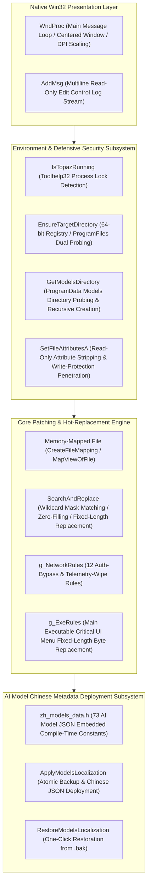

# Developer & Agent Guide

> **Positioning**: Focused on development and maintenance scenarios; avoids redundancy with `README.md` and `Official Analyze.md`.

---

## 1. Technical Selection & Design Principles

This project is a hot-patching and localization engine for **Photo.msi**. The overall codebase adheres to the following principles:

1. **Pure C with Zero Runtime Overhead**
2. **Pure Static Linking & Self-Contained Single Binary**
3. **Environment Decoupling & Defensive I/O**

---

## 2. Core Code Structure & Subsystem Diagram



---

## 3. Core Development Modules & Implementation Mechanisms

### 3.1 Memory Signature Search & Replace Engine (`SearchAndReplace`)

Located in `dup2patcher.c:255`. Utilizes a high-throughput memory mapping mechanism based on `CreateFileMappingA` and `MapViewOfFile`:

```c
typedef struct {
    size_t length;
    const unsigned char* search_bytes;
    const unsigned char* search_mask;   // NULL: Exact match; 1: Wildcard ??, 0: Exact match
    const unsigned char* replace_bytes; // NULL: Fill all with 0x00
    const unsigned char* replace_mask;  // NULL: Overwrite all; 1: Keep original value, 0: Write new value
    int max_occurrences;                // Maximum match count (prevents unintended matches in other code segments)
    const char* description;
} PatchRule;
```

- **Wildcard Mechanism**: When `search_mask[j] == 1`, it treats the byte as a `??` wildcard and skips byte comparison.
- **Safe Replacement**: When `replace_mask[j] == 1`, the original byte in memory is preserved, enabling partial byte instrumentation.
- **Zero-Fill Mode**: When `replace_bytes == NULL`, the matched region is completely overwritten with `0x00` (used to erase telemetry URL strings).

### 3.2 Environment Probing & Adaptive Installation Path (`EnsureTargetDirectory`)

1. **64-bit Registry View Probing**: Uses `RegOpenKeyExA` with `KEY_READ | KEY_WOW64_64KEY` to query `InstallDir` / `Path` / `InstallLocation` under `HKLM\SOFTWARE\Topaz Labs LLC\Topaz Photo AI`.
2. **Environment Variable Fallback**: If the registry key is missing, falls back to `%ProgramFiles%\Topaz Labs LLC\Topaz Photo AI`.
3. **Validity Verification & Redirection**: Verifies whether the target file `network.dll` exists in the directory. Upon confirmation, seamlessly switches the process working directory to the target installation directory via `SetCurrentDirectoryA`.

### 3.3 Model Metadata Static Embedding & Deployment (`ApplyModelsLocalization`)

- **Data Source**: `zh_models/*.json` (73 deep learning model metadata files, covering Denoise, Sharpen, Upscale, SAM Segmentation, Face Recovery, etc.).
- **Compile-Time Embedding**: `zh_models_data.h` embeds all JSONs into the PE data section as C string literals at compile time via the `g_ZhModelFiles` struct array (`filename` and `content`), enabling single-file distribution without external asset packaging.
- **Deployment Logic**: Reads `%ProgramData%\Topaz Labs LLC\Topaz Photo AI\models`, creates a `.bak` backup for each model JSON, and overwrites it with the Chinese localized version.

---

## 4. Key Reverse Engineering Patch Targets (Code Mapping)

Targeting critical authentication and telemetry logic in the host application, the `g_NetworkRules` array implements the following patches:

| Target Rule                               | Assembly / Logic Signature                                 | Patch Strategy                                                    | Corresponding `PatchRule` |
| :---------------------------------------- | :--------------------------------------------------------- | :---------------------------------------------------------------- | :------------------------ |
| **`TAuth::checkAuth` Validation**         | Checks status after reading local cache or server response | Force return true: `mov al, 1; ret` (`B0 01`)                     | `g_NetworkRules[0]`       |
| **Offline State Check Branch**            | Conditional branch following `useCachedCredentials`        | Change `je` to unconditional `jmp` (`EB`) to bypass offline check | `g_NetworkRules[1]`       |
| **Validation Failure Exception Handling** | `test al, al; jz <FailBlock>`                              | Erase `jz` instruction with `NOP`s (`90 90`)                      | `g_NetworkRules[2]`       |
| **Forced Update Popup Dialog**            | Conditional popup branch after version mismatch            | Change conditional jump to short `jmp` to bypass dialog           | `g_NetworkRules[3]`       |
| **`TEventTracker` Telemetry Entry**       | Member function prologue                                   | Replace function entry with `mov al, 1; ret` (`B0 01 C3`)         | `g_NetworkRules[4]`       |
| **`Backtrace` Crash Reporter**            | Entry point for capturing minidumps and system exceptions  | Replace function entry with `mov al, 1; ret` (`B0 01 C3`)         | `g_NetworkRules[5]`       |
| **Online Entitlement Check Logic**        | Conditional jump verifying user subscription tier          | Invert jump condition (`0F 84` -> `0F 85`)                        | `g_NetworkRules[6]`       |
| **Outgoing Telemetry API Endpoints**      | `et.topazlabs.com` / `amplitude.com`, etc.                 | Overwrite URL strings with `0x00` to truncate network requests    | `g_NetworkRules[7~11]`    |

---

## 5. Build Pipeline & Compiler Hardening System

### 5.1 Build Pipeline (`build.sh`)

```bash
# Toolchain
x86_64-w64-mingw32-gcc
x86_64-w64-mingw32-windres

# Core Compilation Flags
CFLAGS="-Wall -Wextra -O2 -s -static -fstack-protector-strong -Wl,--dynamicbase -Wl,--nxcompat -Wl,--high-entropy-va"
LIBS="-lcomctl32 -luser32 -lgdi32 -ladvapi32 -lshlwapi"
```

### 5.2 Security & Stability Compilation Flags Breakdown

- `-static`: Enforces static linking of all standard libraries and stack protector support routines. **Strictly forbidden to remove.**
- `-s`: Strips symbol table and debug information, significantly reducing binary size.
- `-fstack-protector-strong`: Provides strong stack canary protection for functions, preventing buffer overflow exploitation.
- `-Wl,--dynamicbase -Wl,--nxcompat -Wl,--high-entropy-va`: Enables all modern Windows 64-bit security mitigations (ASLR, DEP, High-Entropy ASLR).

---

## 6. Automated Regression Testing Specification

To ensure standalone execution with zero rogue dynamic dependencies and stability, `tests/test_pe_dependencies.sh` must be executed in CI and local development:

### Test Defense Layers:

1. **Dynamic Dependency Blacklist Verification**:
   - Automatically extracts PE import tables (`Import Directory`) via `objdump -p`.
   - Strictly forbidden dependencies: `libssp-0.dll`, `libgcc_s_seh-1.dll`, `libwinpthread-1.dll`, `libstdc++-6.dll`.
2. **System Library Whitelist Validation**:
   - Only standard Windows system libraries are allowed (e.g., `kernel32.dll`, `user32.dll`, `gdi32.dll`, `advapi32.dll`, `shlwapi.dll`, `comctl32.dll`, `msvcrt.dll`).
3. **DLL Export Symbol Integrity**:
   - Verifies that `dup2patcher.dll` must export `load_patcher`, `SearchAndReplace`, and `AddMsg`.

---

## 7. AI Agent Development & Collaboration Protocol

All AI agents processing code, script, or metadata changes in this repository **must strictly follow these development iron rules**:

### 7.1 C Source Code Development Rules

- **Memory & String Safety**: Unbounded `sprintf` / `strcpy` is strictly prohibited in C code; use `snprintf` exclusively and strictly validate buffer bounds.
- **Win32 API Encoding Contract**: Maintain ANSI (`A`) series APIs, paired with UTF-8 code page declarations in `app.manifest`.
- **Fixed-Length Constraints on Signature Replacement**:
  - In `g_ExeRules` string localization replacements, the UTF-8 byte length (including trailing `\0`) of the replacement must be strictly identical to the original English string byte length; pad with `\0` if shorter. Never corrupt PE section offsets.
  - New `PatchRule` definitions must configure accurate `search_mask` and `max_occurrences`.

### 7.2 Build & Commit Workflow

- **Local Verification Required After Modification**: Run `./build.sh` and `./tests/test_pe_dependencies.sh`, ensuring 0 errors and 0 illegal dynamic dependencies.
- **Maintain Clean Repository**: Temporary build artifacts (such as `resource.res`) must not pollute Git commits.
- **Git Commit Messages**: Strictly follow the Conventional Commits format with descriptive commit messages (e.g., `feat: fix errors and improve UI`).
