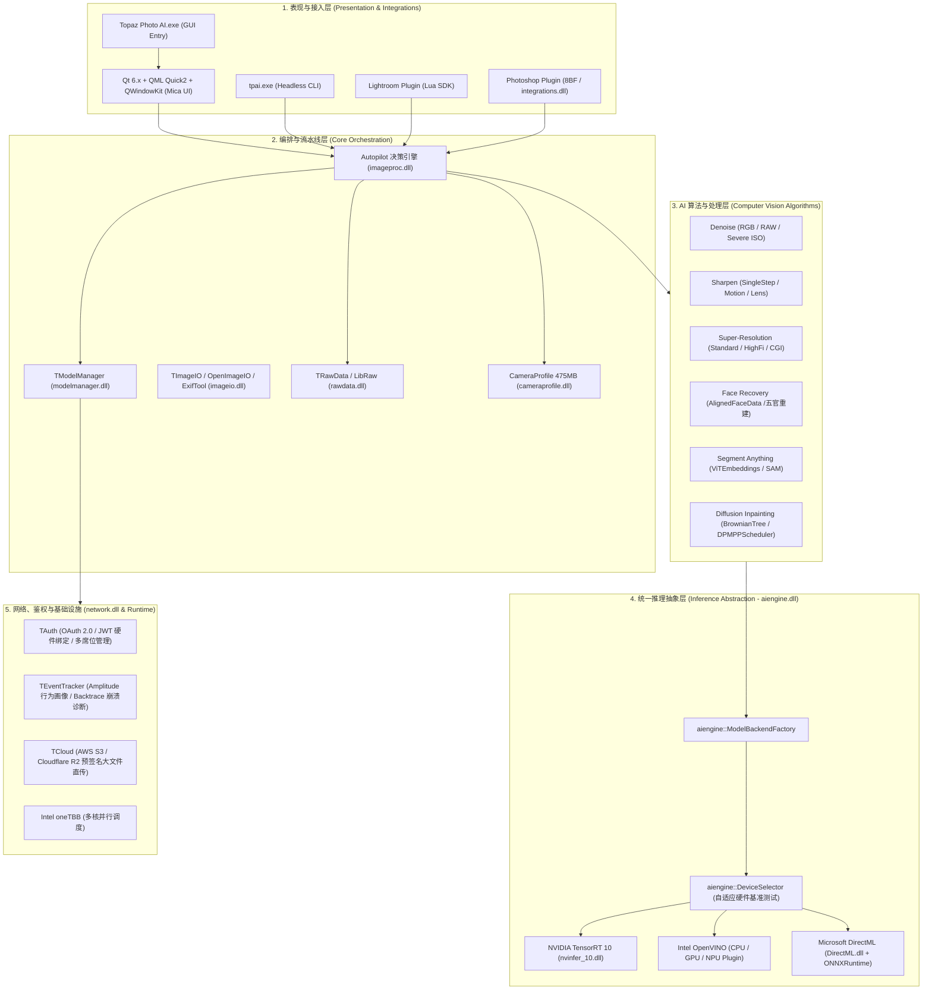
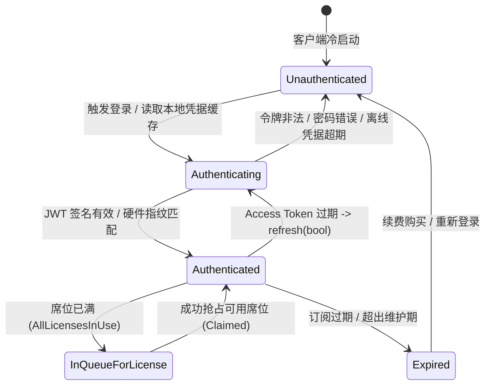
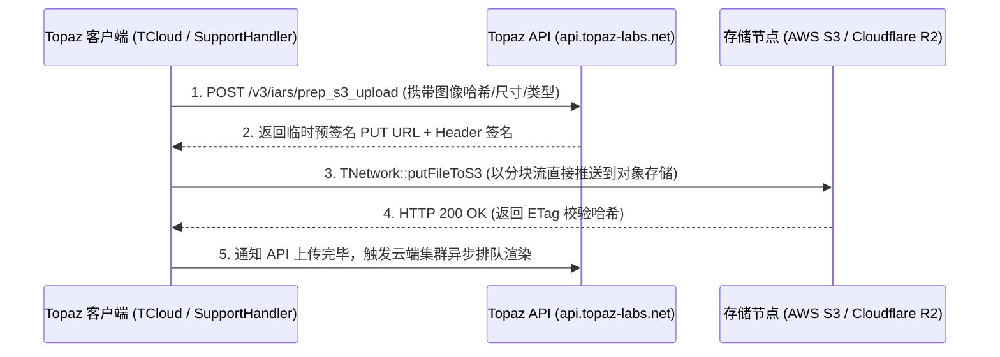

# Photo.msi 深度逆向与系统架构分析报告

> **声明**：本分析报告旨在系统化剖析现代高吞吐、多硬件加速的桌面级 AI 图像处理软件架构，供软件工程、系统安全与图像计算领域学习研究使用。

---

## 目录

- [1. MSI 安装包解构与部署拓扑](#1-msi-安装包解构与部署拓扑)
- [2. 总体软件架构与分层模型](#2-总体软件架构与分层模型)
- [3. 核心子系统深度剖析](#3-核心子系统深度剖析)
  - [3.1 UI 表现层与 Qt6/QML 扩展体系](#31-ui-表现层与-qt6qml-扩展体系)
  - [3.2 跨硬件统一 AI 推理引擎 (`aiengine.dll`)](#32-跨硬件统一-ai-推理引擎-aienginedll)
  - [3.3 计算机视觉与前沿 AI 算法层 (`imageai.dll`)](#33-计算机视觉与前沿-ai-算法层-imageaidll)
  - [3.4 动态模型元数据契约与按需装载 (`models/*.json`)](#34-动态模型元数据契约与按需装载-modelsjson)
  - [3.5 工业级 RAW 解码、色彩管理与镜头校正管线](#35-工业级-raw-解码色彩管理与镜头校正管线)
  - [3.6 【重点深度】授权鉴权、网络协议、云渲染与遥测通信架构 (`network.dll`)](#36-重点深度授权鉴权网络协议云渲染与遥测通信架构-networkdll)
  - [3.7 宿主生态集成与自动化接口 (Lightroom / Photoshop / CLI)](#37-宿主生态集成与自动化接口-lightroom--photoshop--cli)
- [4. 工业级工程实践与架构设计启示](#4-工业级工程实践与架构设计启示)
- [5. 附录：核心组件与符号拓扑总表](#5-附录核心组件与符号拓扑总表)

---

## 1. MSI 安装包解构与部署拓扑

`Photo.msi`（体积约 833 MB）基于微软复合文档二进制打包，核心数据集中封装在内部流 `cab1.cab`（约 867 MB 解包前）中。解包分析显示其严格遵循 Windows 标准的目录分离原则：

```
Photo.msi
├── PFiles/Topaz Labs LLC/Topaz Photo AI/  ──> C:\Program Files\Topaz Labs LLC\Topaz Photo AI\
│   ├── Topaz Photo AI.exe                ──> GUI 主应用程序入口 (Qt6 / QML / C++)
│   ├── tpai.exe                          ──> 命令行与批处理无头引擎 (Headless CLI)
│   ├── *.dll (共 92 个二进制动态库)        ──> 领域计算模块、推理加速运行时、三方依赖
│   ├── qml/                              ──> QtQuick Controls 2 声明式界面与样式定义
│   ├── lensfun/db/*.xml                  ──> 镜头光学畸变与暗角校正数据库
│   ├── translations/*.qm                 ──> 30 国多语言国际化二进制资源
│   └── photo.lrdevplugin/                ──> Adobe Lightroom Classic 外部扩展插件 (Lua)
├── Topaz Labs LLC/Topaz Photo AI/        ──> C:\ProgramData\Topaz Labs LLC\Topaz Photo AI\
│   ├── models/*.json                     ──> 74 个全系列 AI 算法元数据契约描述符
│   ├── filterData/*.json                 ──> Autopilot 智能画质决策树特征库
│   └── Sample Images/                    ──> 官方原版测试图像
└── System64/                             ──> MSVC 2022 x64 基础运行时 (vcruntime140, msvcp140 等)
```

---

## 2. 总体软件架构与分层模型

Topaz Photo AI 采用了高度模块化、关注点分离（Separation of Concerns）的现代分层架构：



---

## 3. 核心子系统深度剖析

### 3.1 UI 表现层与 Qt6/QML 扩展体系

- **框架技术栈**：Qt 6.x x86_64，全量采用 QML 声明式渲染与 C++ 插件机制解耦。
- **原生亚克力与云母特效**：通过内嵌 `QWKCore.dll` / `QWKQuick.dll`（基于开源知名项目 QWindowKit），在 Windows 11/10 上实现了原生 Mica/Acrylic 材质窗口、DWM 阴影以及原生 Snap Layout 贴靠功能。
- **QML C++ 插件总线**：
  - `ImageData/imagedataplugin.dll`：将 C++ 侧的高性能图像矩阵（`cv::Mat`）与内存缓冲区直接暴露给 QML 视图进行纳秒级重绘。
  - `TModelManager/modelmanagerplugin.dll`：向 UI 暴露模型下载速率、动态加载状态与推理设备切换信号。
  - `TNetwork/networkplugin.dll`：双向绑定登录认证、席位选择与网络错误弹窗。
  - `TQmlUtils/qmlutilsplugin.dll`：负责多显示器跨 DPI 缩放与系统色彩空间检测。

---

### 3.2 跨硬件统一 AI 推理引擎 (`aiengine.dll`)

Topaz 没有将算法硬编码绑定在单一推理库上，而是设计了一套精密的**统一推理后端工厂与设备选择器模式**：

1. **智能设备感知 (`aiengine::DeviceSelector`)**：
   - 客户端启动阶段自动扫描系统上的计算设备（NVIDIA CUDA、Intel 核心/独显 GPU、Intel NPU、AMD Radeon GPU 以及多核 CPU）。
   - 针对不同维度的张量尺寸执行微基准测试（Micro-benchmark），自适应构建最佳推理调度链。
2. **多硬件后端实现**：
   - **NVIDIA TensorRT 10 (`nvinfer_10.dll`，310.55 MB)**：针对 GeForce RTX / RTX Quadro 显卡，通过反序列化 CUDA Engine 实现 FP16/INT8 极速吞吐。
   - **Intel OpenVINO (`openvino_intel_cpu_plugin.dll` 39.6MB + `openvino_intel_gpu_plugin.dll` 28.6MB)**：深度利用 AVX-512、AMX 与 Intel Xe 架构核心指令集，优化轻薄本核显与 NPU。
   - **Microsoft DirectML / ONNXRuntime (`DirectML.dll` 17.6MB + `onnxruntime.dll` 14MB)**：通过 DirectX 12 接口通用支持 AMD Radeon 显卡与跨平台异构芯片。

---

### 3.3 计算机视觉与前沿 AI 算法层 (`imageai.dll`)

反编译导出的 184 个算法符号与 RTTI 元数据展示了其强大的模型算法栈：

```cpp
// 核心 RTTI 与导出的关键算法类
class imageai::AIProcessor;               // 主算法任务调度器
class imageai::ViTEmbeddings;             // Vision Transformer 视觉嵌入生成
class imageai::DinoV2TextDetector;        // Meta DINOv2 视觉特征与文字感知
class imageai::SamProcessor;              // Meta SAM (Segment Anything) 全图实例分割
class imageai::FaceEnhancement;           // 人脸特征对齐与五官超分重建
class imageai::DPMPPScheduler;            // 扩散模型 DPM-Solver++ 采样调度器
class imageai::BrownianTree;              // 布朗树噪声模型 (用于生成式局部擦除/修补)
```

- **Meta SAM 智能主体分割**：通过 `samenc-1.json`（ViT 编码器）提取图像高维语义特征，配合 `samdec-1.json`（轻量掩码解码器）实现毫秒级交互式笔刷选择与主体扣图。
- **人脸高保真五官重建**：结合级联人脸检测器定位人脸，做 5 点关键点仿射对齐（`AlignedFaceData`），超分后结合色彩一致性校正模型（`face-clc.json`）与羽化遮罩无缝融合回原图。
- **生成式重构与消除**：采用 `DPMPPScheduler`（DPM-Solver++）与 `BrownianTree`，在图像修补（Inpaint）与微小文字修复中替代传统的 PatchMatch 算法。

---

### 3.4 动态模型元数据契约与按需装载 (`models/*.json`)

安装包中包含了 73 个模型元数据描述符。其**元数据随包装载、权重按需下载**的设计极大地降低了初始分发体积：

| 模型大类                | 典型描述符                                              | 算法/网络类型               | 支持后端                             |
| :---------------------- | :------------------------------------------------------ | :-------------------------- | :----------------------------------- |
| **Denoise (降噪)**      | `denoise-normal-5.json`<br>`denoise-strong-1.json`      | 深度残差卷积 / UNet         | OpenVINO, TensorRT, DirectML, CoreML |
| **Sharpen (锐化)**      | `single-step-sharpen-enc.json`<br>`sharpen-auto-2.json` | SingleStep 编码器-解码器    | OpenVINO, TensorRT, DirectML         |
| **Upscale (超分)**      | `resize-cgi-1.json`<br>`super-focus-dec.json`           | 生成式多尺度超分辨率        | OpenVINO, TensorRT, DirectML         |
| **Face (人脸恢复)**     | `face-clc.json`<br>`face-recovery-v2.json`              | 仿射对齐 + 生成式五官重建   | OpenVINO, TensorRT, DirectML         |
| **Segmentation (分割)** | `samenc-1.json`<br>`samdec-1.json`                      | Meta SAM (Segment Anything) | OpenVINO, TensorRT, DirectML         |
| **Perception (感知)**   | `daclip-features.json`<br>`adjust-normal-1.json`        | DINOv2 / CLIP 多模态特征    | OpenVINO, TensorRT, DirectML         |

**JSON 描述符契约关键设计**：

- `blockOverlap` / `blockDiscard`：分块切片推理的重叠与丢弃边界（彻底消除瓦片拼接 Pseudo-edge 伪影）。
- `zeroCenter` / `clamp`：输入张量的标准化归一化范围（`[-1, 1]` 或 `[0, 1]`）。
- `backends`：定义不同倍率（Scale=1, 2, 4）在各硬件架构下的权重文件名规则（如 `[N]-v[V]-fp16-[H]x[W]-ov.tz2`）。

---

### 3.5 工业级 RAW 解码、色彩管理与镜头校正管线

- **RAW 原始数据流 (`rawdata.dll`)**：底层深度封装 `LibRaw` (`TLibrawData`)，保留 Bayer 阵列未压缩 32 位浮点线性色彩数据。
- **超大规模相机校准库 (`cameraprofile.dll`，475 MB)**：内嵌上千款主流相机的色彩查找表（Adobe DNG Camera Profiles / DCP），针对不同色温光源（`CalibrationIlluminant`：D65、Standard Light A）提供精准的多矩阵色彩空间映射。
- **光学畸变与暗角校正 (`lensfun.dll` + `imagedata.dll`)**：基于 Lensfun 数据库匹配镜头型号，在 `imagedata.dll` 中通过 `LensCorrection` / `ParallelRemap` 进行亚像素级几何畸变消除与色差（CA）修复。

---

### 3.6 【重点深度】授权鉴权、网络协议、云渲染与遥测通信架构 (`network.dll`)

`network.dll` 是整个客户端的**安全基石、状态控制与通信网络中枢**。通过对其导出的 263 个函数符号、RTTI 结构以及 OpenSSL 调用链进行反编译分析，其内部架构设计如下：

```
                              ┌────────────────────────────────────────────────────────┐
                              │                      network.dll                       │
                              └───────────────────────────┬────────────────────────────┘
                                                          │
          ┌───────────────────────┬───────────────────────┴───────────────────────┬───────────────────────┐
          ▼                       ▼                                               ▼                       ▼
┌───────────────────┐   ┌───────────────────┐                           ┌───────────────────┐   ┌───────────────────┐
│   1. 认证鉴权中心   │   │   2. 席位与离线授权  │                           │   3. 云存储与网络层  │   │   4. 遥测与崩溃追踪   │
│     (TAuth /      │   │   (JWT / License  │                           │    (TNetwork /    │   │  (TEventTracker /  │
│  TOAuthHandler)   │   │   *.lic / RLM)    │                           │  TCloud / Store)  │   │   AmplitudeApi)   │
└───────────────────┘   └───────────────────┘                           └───────────────────┘   └───────────────────┘
```

#### 3.6.1 认证中心有限状态机 (`TAuth::AuthState`)

`TAuth` 继承自 `QObject`，采用严格的有限状态机驱动客户端的授权与功能解锁：



**核心状态与方法清单**：

- `state()` / `stateChanged()`：向 QML UI 同步当前鉴权状态。
- `useCachedCredentials()`：读取本地加密存储的 `refresh_token` 并发起后台静默刷新。
- `authenticate(QMap<QString, QVariant>, LicenseTier)`：提交登录凭据并校验许可等级。
- `isSubscription()` / `latestOwnedUpdate()`：区分订阅制客户与买断制客户的最高支持版本号。

---

#### 3.6.2 OAuth 2.0 PKCE 与本地回环代理登录流程

为兼顾用户体验与安全性，Topaz 采用了业界领先的**本地 HTTP 回环代理（Local Loopback Server）**方案，避免了在客户端内嵌大体积且存在安全隐患的浏览器控件（如 CEF 或 QtWebEngine）：

```
[Topaz Photo AI 客户端]                       [系统默认浏览器]                 [Topaz 认证云端]
         │                                          │                             │
         ├──── 1. 启动临时本地 HTTP Server ─────────┤                             │
         │     (监听 127.0.0.1:随机端口)             │                             │
         │                                          │                             │
         ├──── 2. 调用 OS 打开系统浏览器 ────────────>│                             │
         │     (带上 redirect_uri=127.0.0.1:端口)   │                             │
         │                                          ├──── 3. 授权登录 (Google/Apple/账密) ─>│
         │                                          │                                       │
         │                                          │<─── 4. 携带 Auth Code 重定向回本地 ───┤
         │<─── 5. 本地 Server 捕获 Callback ────────┤
         │     (提取 Authorization Code)            │
         │
         ├──── 6. POST /v3/token/refresh (以 Code 换取 JWT Token) ───────────────────────>│
         │<─── 7. 返回 Access Token, Refresh Token, User Profile ──────────────────────────┤
         │
         ├──── 8. 存入本地安全凭据库 (QSettings / OS Keychain)
```

---

#### 3.6.3 JWT 结构、硬件指纹绑定与非对称密码学校验

当客户端向 `https://api.topaz-labs.net/v3/auth/license` 请求授权时，服务端签发包含硬件绑定的 JWT：

```json
{
  "header": {
    "alg": "RS256",
    "typ": "JWT"
  },
  "payload": {
    "sub": "user_102938",
    "email": "photographer@studio.com",
    "machine_id": "a8f9c1e0-3d7b-4b62-98c1-xxxxxxxxxxxx",
    "tier": "Pro",
    "seats_total": 5,
    "exp": 1787491200,
    "features": {
      "autopilot": true,
      "gigapixel_upscale": true,
      "raw_denoise": true
    }
  }
}
```

1. **硬件指纹绑定机制**：
   - 客户端 `TAuth::checkAuth` 会实时采集 CPU ID、网卡 MAC 地址与主板序列号计算唯一机器哈希。
   - 若本地机器哈希与 JWT Payload 中的 `machine_id` 不符，客户端强制置于未授权状态，并抛出错误：`"JWT payload's machine ID does not match this computer"`。
2. **密码学完整性防线**：
   - 客户端集成 OpenSSL 3.x（`libcrypto-3-x64.dll`），使用 `EVP_PKEY_CTX_set_signature_md` 与内置的 Topaz RSA-2048 根公钥进行签名比对，杜绝了中间人篡改 Token Payload 的风险。

---

#### 3.6.4 多席位并发控制与离线断网授权 (Air-Gapped)

针对摄影工作室、企业与机房离线环境，`network.dll` 提供了完备的席位租约与断网方案：

- **多设备席位并发管理**：
  - `claimIndividual()` / `claimPro()`：在客户端启动时向服务器申请占用 1 个可用席位。
  - `deleteSeat(LicenseTier, QString)`：释放指定机器的席位。
  - `InQueueForLicense`：当账户并发数达到购买上限时进入排队状态，支持在客户端界面上一键“远程注销（Revoke）”旧设备的席位。
- **离线许可证文件 (`*.lic`)**：
  - 接口：`loadAuthFile(QString)` 与 `loadRoamingAuthFile(QString, QString)`。
  - 在完全断网的机房中，用户通过离线机器导出的指纹文件在网页端生成带数字签名的 `*.lic` 文件，客户端离线验证签名并支持设定漫游有效期（`License can roam for: X days`）。
- **企业 RLM 浮动许可 (`rlm1611.dll` / `topaz_rlm.dll`)**：
  - 接口：`TAuth::isRlmFlow()` 与 `mapRlmResponseToAuthState(int)`。
  - 支持局域网内通过 Reprise License Manager (RLM) 协议向企业本地许可证服务器动态拉取 License。

---

#### 3.6.5 预签名大文件直传架构 (AWS S3 & Cloudflare R2)

Topaz Photo AI 具备云端 AI 渲染与工单日志收集功能。由于 RAW/TIFF 图像动辄数百兆，其网络层采用了**预签名分步直传（Presigned Direct Upload）**架构：



**架构设计收益**：

- **解耦计算与存储**：超大文件不经过业务 API 网关转发，极大减轻了应用服务器的带宽压力与内存开销。
- **零秘钥泄露风险**：客户端无需硬编码 AWS AccessKey/SecretKey，仅持有几分钟有效期的单次预签名 URL。

---

#### 3.6.6 全量遥测、A/B 实验与崩溃诊断体系

`network.dll` 内部集成了三大互为补充的数据分析与监控管道：

```
┌────────────────────────────────────────────────────────────────────────────────────────┐
│                                    遥测与数据收集体系                                    │
├───────────────────────────┬────────────────────────────┬───────────────────────────────┤
│    1. Amplitude 画像分析   │     2. Backtrace 崩溃诊断   │      3. 第一方行为审计与服务   │
│    (AmplitudeApi)         │     (TEventTracker)        │      (et.topazlabs.com)       │
├───────────────────────────┼────────────────────────────┼───────────────────────────────┤
│ • api2.amplitude.com      │ • events.backtrace.io      │ • et.topazlabs.com/v1/track   │
│ • api.lab.amplitude.com   │ • 抓取 Crashpad minidump   │ • 上报图像处理耗时与模型分类   │
│ • 动态特性标志 (Vardata)    │ • 收集硬件驱动与 OS 异常    │ • 统计功能开关与 Autopilot 命中│
│ • 用户行为留存与漏斗分析    │ • 毫秒级崩溃回传           │ • 软件更新检测与推送           │
└───────────────────────────┴────────────────────────────┴───────────────────────────────┘
```

1. **动态 A/B 灰度实验 (`api.lab.amplitude.com/v1/vardata`)**：
   - 客户端通过 `AmplitudeApi::getFeatures` 动态拉取特性开关（Feature Flags），在不发版的情况下向部分用户灰度开启新的 AI 模型或 Autopilot 调参算法。
2. **崩溃堆栈秒级回传 (`events.backtrace.io`)**：
   - 配合 `crashpad_wer.dll` 和 `Crashpad/crashpad_handler.exe`，当 C++ 或 CUDA 发生未捕获异常时，抓取 Minidump 转储文件并调用 `trackBacktrace` 异步上报，形成工程质量闭环。

---

### 3.7 宿主生态集成与自动化接口 (Lightroom / Photoshop / CLI)

- **Adobe Lightroom Classic 扩展**：
  - 位于 `photo.lrdevplugin/`，基于 Lightroom SDK 6.0 编写。
  - `Export.lua` 拦截导出流，生成临时无损 TIFF/DNG 并调用 `tpai.exe` 或 GUI，处理完成后无缝回写 Lightroom 图库并同步更新 EXIF/IPTC 元数据。
- **Adobe Photoshop 插件 (`integrations.dll`)**：
  - 实现标准 Photoshop 8BF 滤镜接口（`PSPluginData`），通过共享内存与本地套接字（`intercom.dll` 基于 `QLocalServer`/`QLocalSocket`）实现宿主与处理进程间的高速 IPC 双向通信。
- **无头 CLI 批处理 (`tpai.exe`)**：
  - 独立单文件批处理引擎，支持 `--output`、`--recursive`、`--overwrite` 等参数，允许影楼或工作流脚本在服务器上无 GUI 批量处理 RAW 照片。

---

## 4. 工业级工程实践与架构设计启示

| 维度           | Topaz Photo AI 工业级实践                                                                         | 架构设计学习价值 (Takeaways)                                                   |
| :------------- | :------------------------------------------------------------------------------------------------ | :----------------------------------------------------------------------------- |
| **模块解耦**   | 将 UI (QML)、计算 (imageai)、推理 (aiengine)、解码 (rawdata)、网络 (network) 拆分为高内聚动态库。 | 保持顶层业务代码整洁，各子系统独立演进、测试与升级。                           |
| **硬件自适应** | 统一推理工厂隔离 TensorRT / OpenVINO / DirectML。                                                 | 不将软件绑定在特定厂商显卡上，实现跨 NVIDIA、Intel、AMD 的全平台最佳算力释放。 |
| **分发优化**   | 核心安装包仅携带轻量 JSON 契约描述符，权重按需拉取。                                              | 显著降低初始安装包分发体积与 CDN 成本，适应多硬件模型版本的快速迭代。          |
| **分块计算**   | 采用 `blockOverlap` 与 `blockDiscard` 滑动窗口分块推理机制。                                      | 使得 8GB 甚至更小显存的消费级显卡也能无伪影处理上亿像素的巨幅 RAW 图像。       |
| **安全与认证** | OAuth 2.0 PKCE 回环 + JWT 硬件绑定 + S3 预签名直传。                                              | 桌面端拥抱云原生的范本：免维护内嵌浏览器、非对称密码学防伪、云存储直传分流。   |
| **数据闭环**   | 多源遥测 (Amplitude 行为 + Backtrace 崩溃 + 第一方数据)。                                         | 建立线上质量感知防线与数据驱动的产品迭代闭环。                                 |

---

## 5. 附录：核心组件与符号拓扑总表

### 5.1 核心动态库与职责清单

| 动态库名称                         | 体积 (MB) | 主要职责与关键技术                               |
| :--------------------------------- | :-------- | :----------------------------------------------- |
| `Topaz Photo AI.exe`               | 81.8 MB   | GUI 主程序，集成 QML 引擎与主事件循环            |
| `tpai.exe`                         | 81.8 MB   | 无头 CLI 命令行批处理引擎                        |
| `nvinfer_10.dll`                   | 310.5 MB  | NVIDIA TensorRT 10 高性能推理加速引擎            |
| `cameraprofile.dll`                | 475.1 MB  | 475MB 超大规模相机 DCP 色彩查找表与 Adobe XMP 库 |
| `openvino_intel_cpu_plugin.dll`    | 39.6 MB   | Intel OpenVINO CPU 优化插件 (AVX-512 / AMX)      |
| `openvino_intel_gpu_plugin.dll`    | 28.6 MB   | Intel OpenVINO GPU 优化插件 (Arc / Iris Xe)      |
| `DirectML.dll` / `onnxruntime.dll` | 31.7 MB   | 微软 DirectML 与 ONNXRuntime 异构推理后端        |
| `OpenImageIO.dll`                  | 20.8 MB   | 工业级通用图像读写与格式转换库                   |
| `exiftool.dll` / `texiftool.dll`   | 17.6 MB   | ExifTool 专业图像元数据解析与回写引擎            |
| `imageio.dll`                      | 6.4 MB    | Adobe DNG、TIFF、JPEG-Turbo、WebP、EXR 读写实现  |
| `libcrypto-3-x64.dll`              | 5.9 MB    | OpenSSL 3.x 密码学基础库 (EVP, RSA-SHA256)       |
| `imageproc.dll`                    | 1.9 MB    | Autopilot 智能诊断算法与图像调参管线             |
| `imageai.dll`                      | 1.8 MB    | SAM 语义分割、人脸五官超分、扩散消除等 AI 算法   |
| `network.dll`                      | 1.4 MB    | TAuth 认证、OAuth 2.0、S3 预签名直传、遥测追踪   |
| `aiengine.dll`                     | 0.65 MB   | 统一推理后端工厂与自适应设备基准测试器           |
| `rawdata.dll`                      | 0.27 MB   | LibRaw 底层 RAW 解码与 Bayer 阵列处理            |

### 5.2 网络服务端 API 路由总表

| 协议 / 端点                                           | 通信目的                                   | 核心交互类                       |
| :---------------------------------------------------- | :----------------------------------------- | :------------------------------- |
| `https://api.topaz-labs.net/v3/auth/license`          | 换取包含硬件绑定的 JWT 授权许可            | `TAuth::authenticate`            |
| `https://api.topaz-labs.net/v3/auth/seats`            | 申请、释放或查询席位并发占用               | `TAuth::claimPro` / `deleteSeat` |
| `https://api.topaz-labs.net/v3/token/refresh`         | 刷新 Access Token 令牌                     | `TAuth::refresh`                 |
| `https://api.topaz-labs.net/v3/iars/prep_s3_upload`   | 获取 AWS S3 / Cloudflare R2 预签名上传 URL | `TCloud` / `TNetwork`            |
| `https://api.topaz-labs.net/v3/support/create_ticket` | 提交技术支持工单与转储附件                 | `SupportHandler::submitTicket`   |
| `https://api2.amplitude.com/identify`                 | 上报用户设备属性与画像标识                 | `AmplitudeApi::identify`         |
| `https://api.lab.amplitude.com/v1/vardata`            | 动态拉取 A/B 灰度实验与特性开关            | `AmplitudeApi::getFeatures`      |
| `https://events.backtrace.io`                         | 毫秒级回传崩溃转储 Minidump                | `TEventTracker::trackBacktrace`  |
| `https://et.topazlabs.com/v1/track`                   | 第一方功能使用频率与图像处理耗时审计       | `TEventTracker::track`           |

---
